# CI for iOS projects

For all iOS projects at conichi, we decided to use Jenkins solution as an in-house continuous integration tool.
There are some benefits for our choice:
* Broad range of plugins for the CI
* Full control of the build process and CI machine status
* Fewer dependencies on external partners

### Prepare a project for Jenkins CI

See the [guide](new_project_guide.md)

### Setup GitHub hooks

To let Jenkins listen the GitHub's events the hooks need to be configured in the repo. Please be sure your account has rights to create a webhook, if no ping [@antondomashnev](https://github.com/Antondomashnev) or [@dimango](https://github.com/adimango)
1. Go to the https://github.com/conichiGMBH/#{you_repo_name}/settings/hooks
2. Add PUSH web hook
```
Payload URL: http://jenkins-conichi.eu.ngrok.io/github-webhook/
Content type: application/json
Which events would you like to trigger this webhook?: Just the push event.
Active: true
```
3. Add PRs web hook
```
Payload URL: http://jenkins-conichi.eu.ngrok.io/ghprbhook/
Content type:application/x-www-form-urlencoded
Which events would you like to trigger this webhook?: Let me select individual events. -> Issue comment
& Pull request
Active: true
```

In the end you will see exactly the following:
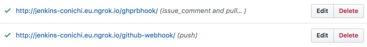

### Create a Jenkins job

Please find the `Jenkins Web Interface` item in conichi 1password and login into our Jenkins web interface with it's credentials

*Start creating a new item in Jenkins dashboard*
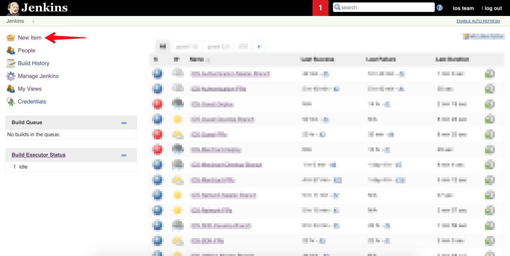

#### Default branch watcher

First create a default branch watcher (usually master or develop).
For that type of jobs please follow the naming convention: `iOS-#{Project_Short_Name}-#{Branch_Name}-Branch`.

*Start creating a new item in Jenkins dashboard. Inherit from already existed set up to simplify the life*
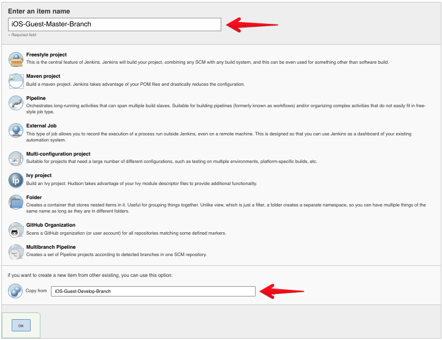

*Set correct job name, add proper description, type valid url to the project*
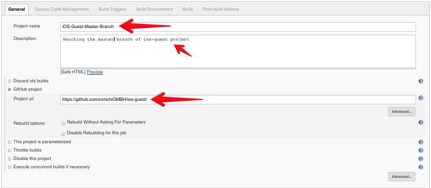  

*Set ssh format of the URL so Jenkins will be able to clone the project and specify branch to watch*
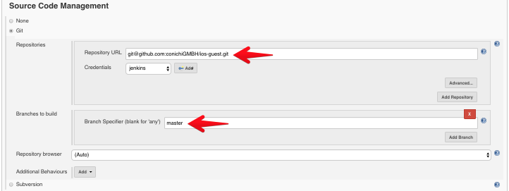  

*Let Jenkins to listen for PUSH hook from GitHub*
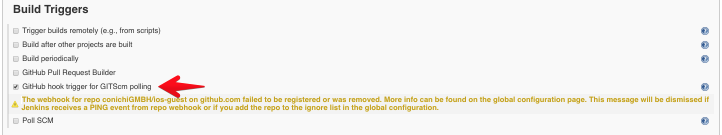

*To manage ruby version and bundle we use RVM and the related plugin for Jenkins*
*Also to not annoy anyone with a stale build, we use timeout for 120 seconds when there is no activity in logs*
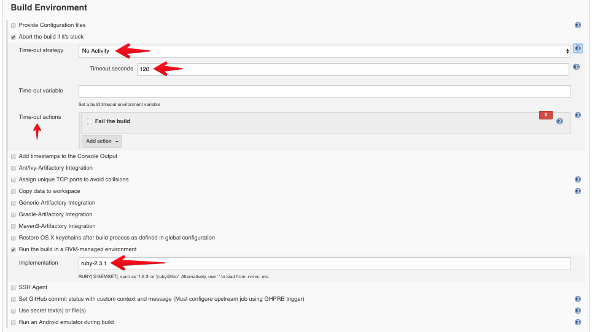

*Please type the scripts to run, if you follow the general approach it's just a make ci*
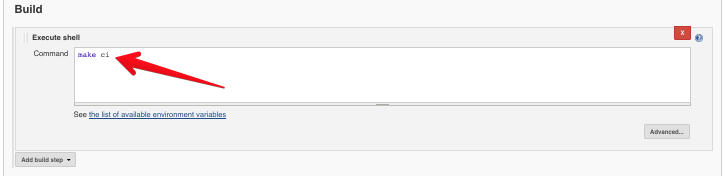

*Save the job and test it*  
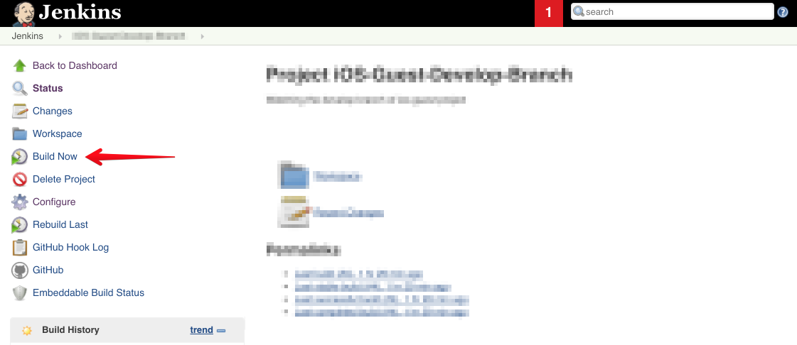

If the build succeeded, you're set, congratulations!

#### PR's watcher

Another important job for each project is a one to run on each Pull Request
For that type of jobs please follow the naming convention: `iOS-#{Project_Short_Name}-PRs`
Start creating a new item in Jenkins dashboard  

*Create a new job following the naming convention. Inherit from already existed set up to simplify the life*
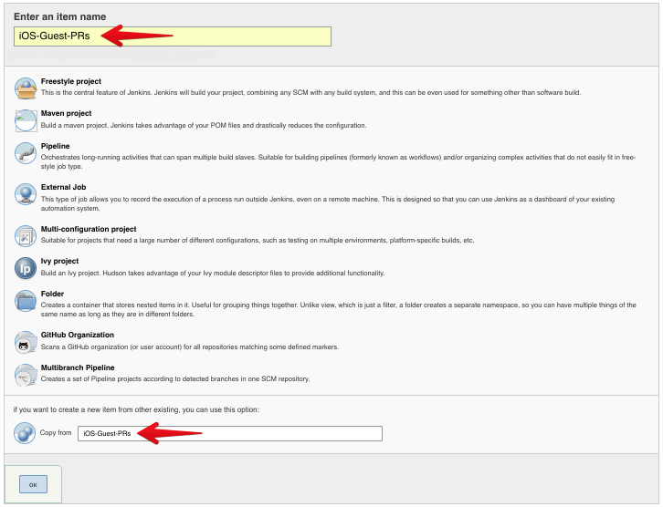  

*Set proper job name, description and the project URL*
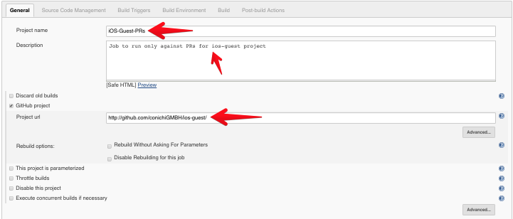  

*Let Jenkins to listen for Pull Request hooks from GitHub. ${sha1} - is a parameter to listen the PRs*
*Set ssh format of the URL so Jenkins will be able to clone the project and specify branch to watch*
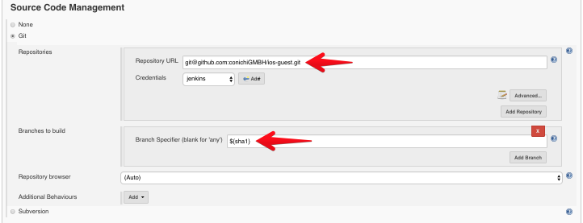

*As an admin please be sure to add yourself, so you will be able to trigger the build from GitHub's comment in PR*
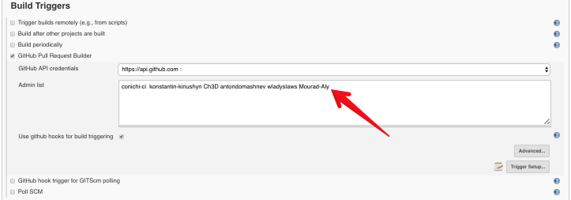

*To manage ruby version and bundle we use RVM and the related plugin for Jenkins*
*Also to not annoy anyone with a stale build, we use timeout for 120 seconds when there is no activity in logs*


*Please type the scripts to run, if you follow the general approach it's just a make ci*
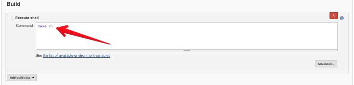

## Test your setup

To test the `Branch Watcher` you can always click `Build Now` in the web interface of the Jenkins's job.
To test the `PRs Watcher` you have to be an admin in the job's setup and you can trigger the test using `retest` comment.

If all is green, you're set, congratulations!
